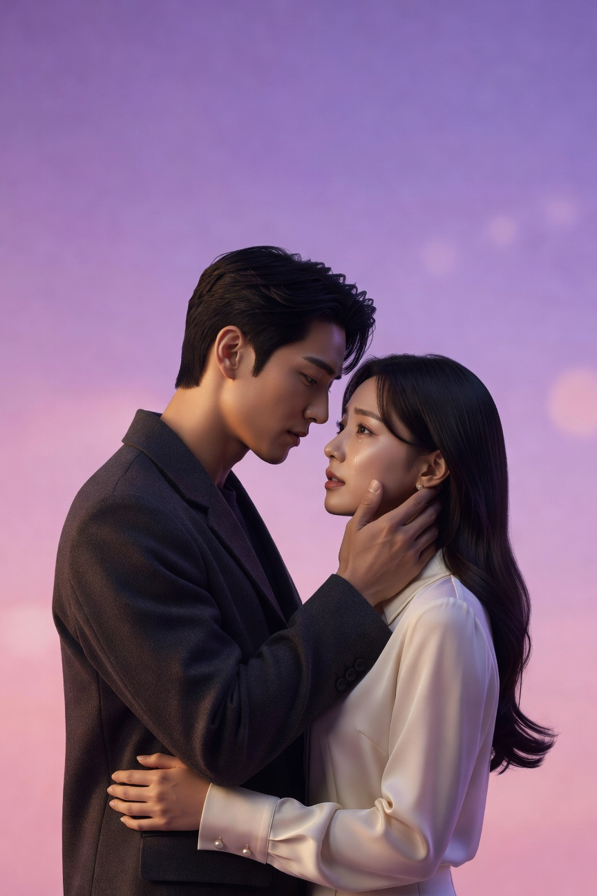
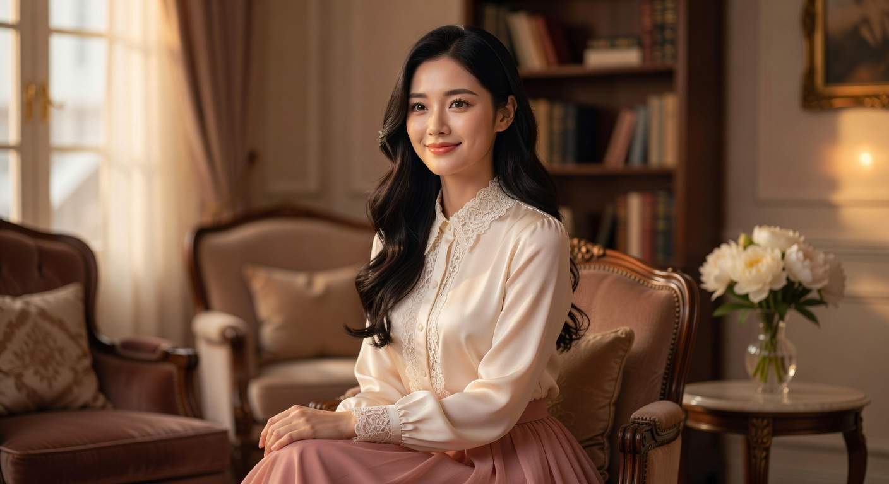

# ✨ K-Drama Character Creator

Discover your K-Drama alter ego! This AI-powered personality quiz matches you with Korean drama characters based on your personality traits. Features stunning AI-generated artwork and shareable results!



## 🎭 Live Demo

**Try it now:** [https://japanclassicstore-cyber.github.io/k-drama-character-creator](https://japanclassicstore-cyber.github.io/k-drama-character-creator)

## ✨ Features

- 🎭 **AI-Powered Analysis** - Advanced personality matching algorithm
- ✨ **Unique Character Art** - AI-generated character artwork
- 📱 **Shareable Results** - Share your K-Drama alter ego on social media
- 🎨 **Beautiful Design** - Professional K-drama aesthetic
- 📊 **8 Personality Questions** - Deep personality analysis
- 🎯 **4 Character Archetypes** - Romantic Lead, Chaebol, Second Lead, Career Woman

## 🚀 Technologies Used

- **Frontend:** HTML5, CSS3, Vanilla JavaScript
- **AI Image Generation:** xAI Grok API
- **Fonts:** Google Fonts (Playfair Display, Noto Sans KR)
- **Hosting:** GitHub Pages

## 📸 Screenshots

### Hero Section


### Character Results


## 🎮 How to Play

1. Click "Start Your Journey" on the homepage
2. Answer 8 personality questions
3. Discover your K-Drama character match
4. Share your results with friends!

## 🎨 Character Types

### 💝 The Romantic Lead
The heart-fluttering main character everyone roots for!

### 👔 The Chaebol Heir
Ice prince/princess with a secretly warm heart

### 🌟 The Second Lead
The loyal supporter who deserves love too

### 💼 The Career Woman
Independent achiever who writes her own story

## 🔧 Installation

```bash
# Clone the repository
git clone https://github.com/japanclassicstore-cyber/k-drama-character-creator.git

# Navigate to directory
cd k-drama-character-creator

# Open in browser
open index.html
```

## 📝 License

MIT License - feel free to use this project for your own purposes!

## 🙏 Credits

- Images generated using xAI Grok API
- Inspired by the wonderful world of Korean dramas
- Built with ❤️ by Forge AI

## 🌟 Star History

If you like this project, please give it a star! ⭐

---

**Made with 💖 for K-Drama fans everywhere!**
